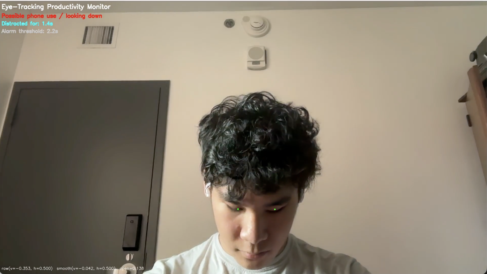

Eye-Tracking Productivity Monitor is a real-time computer vision application designed to help users stay focused while studying or working. By using a laptop webcam, eye tracking, and attention classification logic, the system detects when a user is repeatedly looking away from the screen or looking down at a phone, then responds with an audible alert.

## Inspiration

The idea for this project came from a common productivity problem: losing focus during work sessions. Even a quick glance at a phone can turn into a much longer distraction. I wanted to build something practical that could act as an immediate reminder to stay engaged, while also giving me the opportunity to explore computer vision, human behavior detection, and real-time software design.

## What It Does

Eye-Tracking Productivity Monitor uses a laptop camera to track the user’s face, eyes, and gaze direction in real time. By analyzing iris position and eye openness, the program estimates whether the user is focused on the screen, looking away to the left or right, looking down, or no longer visible to the camera. If distraction continues for long enough, the application plays a loud alert sound to help the user return attention to their work. It also displays live status text and timing information directly on the video feed.

## How I Built It

- Video Capture: The system continuously reads live frames from the user’s webcam using OpenCV
- Face and Eye Tracking: MediaPipe Face Mesh is used to detect facial landmarks, including detailed eye and iris points
- Gaze Estimation: The program computes horizontal and vertical eye ratios to estimate whether the user is focused, looking left, looking right, or looking down
- Attention Classification: A distraction classifier uses threshold logic, hysteresis, and smoothing to reduce false positives from natural head and eye movement
- Alert System: If distraction lasts beyond a defined threshold, the program triggers a platform-aware audio alert
- User Feedback: The interface overlays real-time status, distraction duration, and debug information directly on the video stream

## Challenges I Ran Into

- Eye tracking is highly sensitive to lighting conditions, webcam quality, head position, and small user movements
- Defining distraction precisely was difficult, since looking away from a screen does not always mean someone is off task
- Reducing false alarms required careful tuning of thresholds, smoothing factors, recovery timing, and face-loss handling
- Making the alert responsive without becoming too aggressive required balancing timing and cooldown behavior

## Accomplishments I am Proud Of

- Building a working real-time prototype that responds to live user behavior
- Successfully integrating webcam input, facial landmark detection, gaze estimation, and audio alerts into one system
- Designing a distraction detection pipeline that is practical enough to demonstrate an everyday use case
- Creating a project that connects computer vision concepts with a real productivity problem

## What I Learned

- How to use OpenCV and MediaPipe together for live facial landmark and eye tracking
- How thresholding, hysteresis, and exponential smoothing can improve reliability in real-time detection systems
- The importance of system tuning when working with noisy real-world input like camera data
- How human-centered design affects technical decisions when building tools meant for everyday use

## What Is Next

- Improving robustness across different lighting conditions, webcams, and seating positions
- Expanding the distraction model to recognize additional off-task behaviors
- Adding data logging or analytics so users can review focus trends over time
- Exploring more adaptive alerts and personalized calibration for different users

Overall, this project was a valuable experience because it combined programming, debugging, system integration, and computer vision into one practical application. It strengthened my interest in intelligent software systems and showed how ECE concepts can be applied to real everyday challenges.
